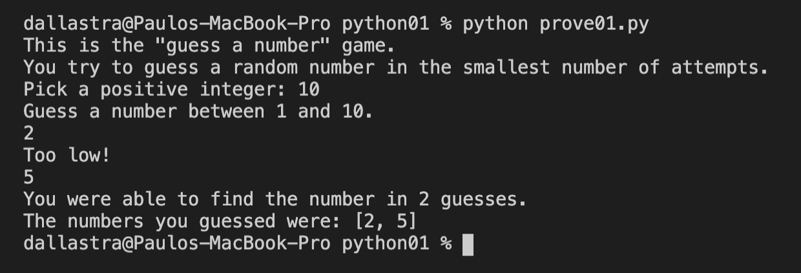

# OVERVIEW

This is a simple Guess Game to get started learning Python.
The only library imported is "random" to generate a different value
automatically. The program will ask you the limit of numbers where you want to guess between the chosen number and 0.

## Development Environment

* Visual Studio Code
* Python 3

## Execution

To execute the program, use the command: `python3 prove01.py` on your terminal. Then you need to pick a number to give the program
a base to generate the random number. After that is just type your
guess and press "ENTER/RETURN" to see if you guessed lower or
higher than the generated number.

